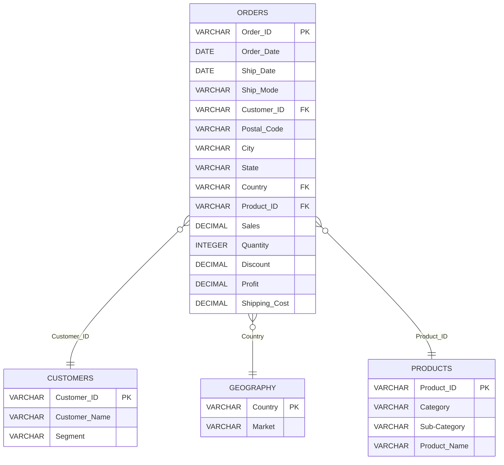

Na podstawie analizy tabel i wymagań z zadania, oto propozycja modelu implementacyjnego:

1. Tabela "Orders":
   - Order ID (klucz główny, typ: VARCHAR, NOT NULL)
   - Country (klucz obcy do tabeli "Geography", typ: VARCHAR, NOT NULL)
   - Product ID (klucz obcy do tabeli "Products", typ: VARCHAR, NOT NULL)
   - Order Date (typ: DATE, NOT NULL)
   - Ship Date (typ: DATE)
   - Ship Mode (typ: VARCHAR)
   - Customer ID (klucz obcy do tabeli "Customers", typ: VARCHAR, NOT NULL)
   - Postal Code (typ: VARCHAR)
   - City (typ: VARCHAR)
   - State (typ: VARCHAR)
   - Sales (typ: DECIMAL)
   - Quantity (typ: INTEGER)
   - Discount (typ: DECIMAL)
   - Profit (typ: DECIMAL)
   - Shipping Cost (typ: DECIMAL)

2. Tabela "Customers":
   - Customer ID (klucz główny, typ: VARCHAR, NOT NULL)
   - Customer Name (typ: VARCHAR, NOT NULL)
   - Segment (typ: VARCHAR)

3. Tabela "Geography":
   - Country (klucz główny, typ: VARCHAR, NOT NULL)
   - Market (typ: VARCHAR, NOT NULL)

4. Tabela "Products":
   - Product ID (klucz główny, typ: VARCHAR, NOT NULL)
   - Category (typ: VARCHAR, NOT NULL)
   - Sub-Category (typ: VARCHAR, NOT NULL)
   - Product Name (typ: VARCHAR, NOT NULL)

Relacje między tabelami:
- Tabela "Orders" ma relację wiele-do-jednego z tabelą "Customers" poprzez klucz obcy "Customer ID".
- Tabela "Orders" ma relację wiele-do-jednego z tabelą "Geography" poprzez klucz obcy "Country".
- Tabela "Orders" ma relację wiele-do-jednego z tabelą "Products" poprzez klucz obcy "Product ID".

Diagram ERD (Entity-Relationship Diagram) przedstawiający model implementacyjny:

Ten model implementacyjny uwzględnia wszystkie wymagane encje, atrybuty, klucze główne i obce oraz relacje między tabelami. Typy danych są dostosowane do charakteru przechowywanych informacji. Kolumny oznaczone jako "NOT NULL" reprezentują obowiązkowe wartości.

Mam nadzieję, że ten model implementacyjny spełnia wymagania zadania. W razie potrzeby można go jeszcze dostosować lub rozszerzyć.

# Rozszrzenia:
Oczywiście, oto kilka propozycji rozszerzenia i usprawnień modelu implementacyjnego:

1. Dodanie tabeli "Shipping Methods":
   - Shipping Method ID (klucz główny, typ: VARCHAR, NOT NULL)
   - Shipping Method Name (typ: VARCHAR, NOT NULL)
   - Description (typ: VARCHAR)
   Tabela "Orders" miałaby relację wiele-do-jednego z tabelą "Shipping Methods" poprzez klucz obcy "Shipping Method ID". To pozwoliłoby na lepszą normalizację danych i łatwiejsze zarządzanie metodami wysyłki.

2. Rozdzielenie adresu na osobne kolumny w tabeli "Orders":
   - Street (typ: VARCHAR)
   - City (typ: VARCHAR)
   - State (typ: VARCHAR)
   - Postal Code (typ: VARCHAR)
   - Country (klucz obcy do tabeli "Geography", typ: VARCHAR, NOT NULL)
   To umożliwiłoby bardziej szczegółowe analizy geograficzne i ułatwiłoby walidację danych adresowych.

3. Dodanie tabeli "Discounts":
   - Discount ID (klucz główny, typ: VARCHAR, NOT NULL)
   - Discount Name (typ: VARCHAR, NOT NULL)
   - Discount Percentage (typ: DECIMAL, NOT NULL)
   - Description (typ: VARCHAR)
   Tabela "Orders" miałaby relację wiele-do-jednego z tabelą "Discounts" poprzez klucz obcy "Discount ID". To pozwoliłoby na lepsze zarządzanie różnymi rodzajami rabatów i promocji.

5. Dodanie tabeli "Inventory":
   - Product ID (klucz obcy do tabeli "Products", typ: VARCHAR, NOT NULL)
   - Quantity (typ: INTEGER, NOT NULL)
   Ta tabela śledziłaby stan magazynowy każdego produktu, co ułatwiłoby zarządzanie zapasami i unikanie sytuacji braku produktu na stanie.

6. Dodanie ograniczeń (constraints) do tabel:
   - Ograniczenie "CHECK" na kolumnie "Quantity" w tabeli "Orders", aby upewnić się, że wartość jest zawsze większa od zera.
   - Ograniczenie "CHECK" na kolumnie "Discount Percentage" w tabeli "Discounts", aby upewnić się, że wartość mieści się w przedziale od 0 do 1.

Pamiętaj, że te propozycje są opcjonalne i zależą od konkretnych wymagań biznesowych i przypadków użycia. Przed wdrożeniem jakichkolwiek zmian warto dokładnie przeanalizować ich wpływ na system i upewnić się, że są zgodne z ogólną architekturą i celami projektu.

# Version 0.0.2
Świetny pomysł! Dodanie informacji o adresach dostawy dla klientów z pewnością poprawi funkcjonalność aplikacji i umożliwi generowanie bardziej szczegółowych statystyk. Oto propozycja zmodyfikowanej architektury:

1. Tabela "Customers":
   - Customer ID (klucz główny, typ: VARCHAR, NOT NULL)
   - Customer Name (typ: VARCHAR, NOT NULL)
   - Segment (typ: VARCHAR)

2. Tabela "Addresses":
   - Address ID (klucz główny, typ: VARCHAR, NOT NULL)
   - Customer ID (klucz obcy do tabeli "Customers", typ: VARCHAR, NOT NULL)
   - Address Line 1 (typ: VARCHAR, NOT NULL)
   - Address Line 2 (typ: VARCHAR)
   - City (typ: VARCHAR, NOT NULL)
   - State (typ: VARCHAR)
   - Postal Code (typ: VARCHAR, NOT NULL)
   - Country (klucz obcy do tabeli "Geography", typ: VARCHAR, NOT NULL)
   - Phone (typ: VARCHAR)
   - Is Default (typ: BOOLEAN, NOT NULL)

3. Tabela "Orders":
   - Order ID (klucz główny, typ: VARCHAR, NOT NULL)
   - Customer ID (klucz obcy do tabeli "Customers", typ: VARCHAR, NOT NULL)
   - Shipping Address ID (klucz obcy do tabeli "Addresses", typ: VARCHAR, NOT NULL)
   - Order Date (typ: DATE, NOT NULL)
   - Ship Date (typ: DATE)
   - Ship Mode (typ: VARCHAR)
   - Product ID (klucz obcy do tabeli "Products", typ: VARCHAR, NOT NULL)
   - Sales (typ: DECIMAL)
   - Quantity (typ: INTEGER)
   - Discount (typ: DECIMAL)
   - Profit (typ: DECIMAL)
   - Shipping Cost (typ: DECIMAL)

4. Tabela "Geography" (bez zmian):
   - Country (klucz główny, typ: VARCHAR, NOT NULL)
   - Market (typ: VARCHAR, NOT NULL)

5. Tabela "Products" (bez zmian):
   - Product ID (klucz główny, typ: VARCHAR, NOT NULL)
   - Category (typ: VARCHAR, NOT NULL)
   - Sub-Category (typ: VARCHAR, NOT NULL)
   - Product Name (typ: VARCHAR, NOT NULL)

Relacje między tabelami:
- Tabela "Customers" ma relację jeden-do-wielu z tabelą "Addresses" poprzez klucz obcy "Customer ID".
- Tabela "Orders" ma relację wiele-do-jednego z tabelą "Customers" poprzez klucz obcy "Customer ID".
- Tabela "Orders" ma relację wiele-do-jednego z tabelą "Addresses" poprzez klucz obcy "Shipping Address ID".
- Tabela "Orders" ma relację wiele-do-jednego z tabelą "Products" poprzez klucz obcy "Product ID".
- Tabela "Addresses" ma relację wiele-do-jednego z tabelą "Geography" poprzez klucz obcy "Country".

Ta architektura wprowadza nową tabelę "Addresses", która przechowuje informacje o adresach dostawy dla każdego klienta. Klienci mogą mieć wiele adresów, a każde zamówienie jest powiązane z konkretnym adresem dostawy.

Dzięki temu aplikacja zyskuje możliwość zapisywania i zarządzania adresami dostawy dla klientów. Klienci mogą dodawać, edytować i usuwać swoje adresy, a podczas składania zamówienia mogą wybrać jeden z zapisanych adresów jako adres dostawy.

Ponadto, ta struktura umożliwia generowanie bardziej szczegółowych statystyk, takich jak:
- Analiza sprzedaży i zyskowności według regionów geograficznych na podstawie adresów dostawy.
- Identyfikacja najpopularniejszych miast i krajów, do których są wysyłane zamówienia.
- Segmentacja klientów na podstawie ich adresów (np. klienci z dużych miast vs. klienci z mniejszych miejscowości).

Oczywiście, przed wdrożeniem tej architektury należy dokładnie przeanalizować wymagania biznesowe i przypadki użycia, aby upewnić się, że proponowane zmiany są odpowiednie dla danego projektu.

# Fianl

Oczywiście, oto zmodyfikowana architektura z uwzględnieniem tabel "Addresses" i "Shipping Methods", wykorzystująca tylko istniejące pola z pliku data.xlsx oraz dodatkowe klucze:

1. Tabela "Customers":
   - Customer ID (klucz główny, typ: VARCHAR, NOT NULL)
   - Customer Name (typ: VARCHAR, NOT NULL)
   - Segment (typ: VARCHAR)

2. Tabela "Addresses":
   - Address ID (klucz główny, typ: VARCHAR, NOT NULL)
   - Customer ID (klucz obcy do tabeli "Customers", typ: VARCHAR, NOT NULL)
   - Postal Code (typ: VARCHAR)
   - City (typ: VARCHAR)
   - State (typ: VARCHAR)
   - Country (klucz obcy do tabeli "Geography", typ: VARCHAR, NOT NULL)

3. Tabela "Orders":
   - Order ID (klucz główny, typ: VARCHAR, NOT NULL)
   - Customer ID (klucz obcy do tabeli "Customers", typ: VARCHAR, NOT NULL)
   - Shipping Address ID (klucz obcy do tabeli "Addresses", typ: VARCHAR, NOT NULL)
   - Order Date (typ: DATE, NOT NULL)
   - Ship Date (typ: DATE)
   - Shipping Method ID (klucz obcy do tabeli "Shipping Methods", typ: VARCHAR, NOT NULL)
   - Product ID (klucz obcy do tabeli "Products", typ: VARCHAR, NOT NULL)
   - Sales (typ: DECIMAL)
   - Quantity (typ: INTEGER)
   - Discount (typ: DECIMAL)
   - Profit (typ: DECIMAL)
   - Shipping Cost (typ: DECIMAL)

4. Tabela "Shipping Methods":
   - Shipping Method ID (klucz główny, typ: VARCHAR, NOT NULL)
   - Ship Mode (typ: VARCHAR, NOT NULL)

5. Tabela "Geography":
   - Country (klucz główny, typ: VARCHAR, NOT NULL)
   - Market (typ: VARCHAR, NOT NULL)

6. Tabela "Products":
   - Product ID (klucz główny, typ: VARCHAR, NOT NULL)
   - Category (typ: VARCHAR, NOT NULL)
   - Sub-Category (typ: VARCHAR, NOT NULL)
   - Product Name (typ: VARCHAR, NOT NULL)

Relacje między tabelami:
- Tabela "Customers" ma relację jeden-do-wielu z tabelą "Addresses" poprzez klucz obcy "Customer ID".
- Tabela "Orders" ma relację wiele-do-jednego z tabelą "Customers" poprzez klucz obcy "Customer ID".
- Tabela "Orders" ma relację wiele-do-jednego z tabelą "Addresses" poprzez klucz obcy "Shipping Address ID".
- Tabela "Orders" ma relację wiele-do-jednego z tabelą "Shipping Methods" poprzez klucz obcy "Shipping Method ID".
- Tabela "Orders" ma relację wiele-do-jednego z tabelą "Products" poprzez klucz obcy "Product ID".
- Tabela "Addresses" ma relację wiele-do-jednego z tabelą "Geography" poprzez klucz obcy "Country".

W tej architekturze mamy oddzielne tabele "Addresses" i "Shipping Methods", które wykorzystują istniejące pola z pliku data.xlsx. Tabela "Addresses" przechowuje informacje o adresach dostawy dla każdego klienta, a tabela "Shipping Methods" zawiera dostępne metody wysyłki.

Dzięki tej strukturze możemy osiągnąć następujące korzyści:
- Klienci mogą mieć wiele adresów dostawy, co umożliwia im wybór odpowiedniego adresu podczas składania zamówienia.
- Metody wysyłki są oddzielone od zamówień, co ułatwia zarządzanie i dodawanie nowych opcji wysyłki w przyszłości.
- Można generować bardziej szczegółowe statystyki i analizy na podstawie adresów dostawy i metod wysyłki.

Pamiętaj, że ta architektura wymaga dodania dodatkowych kluczy (Address ID, Shipping Method ID) do istniejącej struktury danych, ale wykorzystuje tylko istniejące pola z pliku data.xlsx.

Oczywiście, oto zmodyfikowana architektura zgodnie z Twoimi wytycznymi:

1. Tabela "Customers":
   - Customer ID (klucz główny, typ: VARCHAR, NOT NULL)
   - Customer Name (typ: VARCHAR, NOT NULL)
   - Segment (typ: VARCHAR)

2. Tabela "Orders":
   - Order ID (klucz główny, typ: VARCHAR, NOT NULL)
   - Customer ID (klucz obcy do tabeli "Customers", typ: VARCHAR, NOT NULL)
   - Country (klucz obcy do tabeli "Geography", typ: VARCHAR, NOT NULL)
   - Order Date (typ: DATE, NOT NULL)
   - Ship Date (typ: DATE)
   - Ship Mode (typ: VARCHAR)
   - Postal Code (typ: VARCHAR)
   - City (typ: VARCHAR)
   - State (typ: VARCHAR)

3. Tabela "Order Details":
   - Order Detail ID (klucz główny, typ: VARCHAR, NOT NULL)
   - Order ID (klucz obcy do tabeli "Orders", typ: VARCHAR, NOT NULL)
   - Product ID (klucz obcy do tabeli "Products", typ: VARCHAR, NOT NULL)
   - Sales (typ: DECIMAL)
   - Quantity (typ: INTEGER)
   - Discount (typ: DECIMAL)
   - Profit (typ: DECIMAL)
   - Shipping Cost (typ: DECIMAL)

4. Tabela "Geography":
   - Country (klucz główny, typ: VARCHAR, NOT NULL)
   - Market (typ: VARCHAR, NOT NULL)

5. Tabela "Products":
   - Product ID (klucz główny, typ: VARCHAR, NOT NULL)
   - Category (typ: VARCHAR, NOT NULL)
   - Sub-Category (typ: VARCHAR, NOT NULL)
   - Product Name (typ: VARCHAR, NOT NULL)

Relacje między tabelami:
- Tabela "Orders" ma relację wiele-do-jednego z tabelą "Customers" poprzez klucz obcy "Customer ID".
- Tabela "Orders" ma relację wiele-do-jednego z tabelą "Geography" poprzez klucz obcy "Country".
- Tabela "Order Details" ma relację wiele-do-jednego z tabelą "Orders" poprzez klucz obcy "Order ID".
- Tabela "Order Details" ma relację wiele-do-jednego z tabelą "Products" poprzez klucz obcy "Product ID".

W tej architekturze:
- Informacje o adresie dostawy zostały przeniesione do tabeli "Orders", co eliminuje potrzebę oddzielnej tabeli "Addresses".
- Utworzono nową tabelę "Order Details", która przechowuje szczegóły zamówienia, takie jak sprzedaż, ilość, rabat, zysk i koszt wysyłki. To odciąża tabelę "Orders" i umożliwia przechowywanie wielu produktów dla jednego zamówienia.
- Metoda wysyłki (Ship Mode) została przeniesiona z powrotem do tabeli "Orders".

Ta architektura zapewnia bardziej zwartą strukturę i eliminuje potrzebę dodatkowych tabel, jednocześnie zachowując wszystkie niezbędne informacje. Nadal można generować szczegółowe statystyki i analizy na podstawie danych adresowych i szczegółów zamówienia.

Pamiętaj, że ta propozycja wykorzystuje tylko istniejące pola z pliku data.xlsx i wprowadza minimalne zmiany w stosunku do oryginalnej struktury danych.